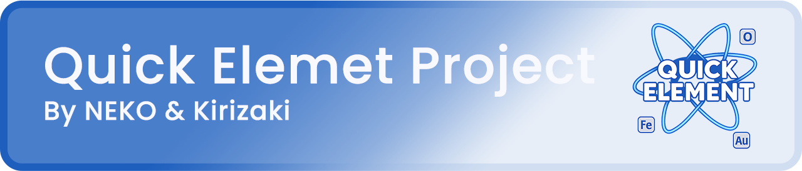

<h1 align="center">Quick Element</h1>

**Quick Element** is an Web based card game inspired by ~~Dominoes and Uno~~ Crossword. The core theme of the game is about forming chemical bonds between different elements.

## Objective
The goal is to teach players about chemical bonding through a fun and accessible game format. By borrowing mechanics from popular games like **Uno** and **Dominoes**, it’s a perfect fit for players of all ages and backgrounds.

## Gameplay
* Quick Element is a 2-player, turn-based card game.
* Each player starts with a hand of 5 cards and one random card on the board.
* On each turn, a player must place a card to form a chemical bond with an existing element on the board.
* If a player cannot place a card, they must draw one card and their turn ends. If the drawn card can be placed, they can play it immediately.
* When the board is completely filled and no more bonds can be formed, the game clears the board and a new random starting card is drawn.

> [!WARNING] 
> Only Concept image gameplay not the final result.

## What if a player has no knowledge of chemistry?
> [!TIP] 
> When you select a card, **Quick Element** highlights the valid spots where you can place it. This ensures that anyone can enjoy the game and learn about chemical bonds as they play, regardless of their chemistry background.

